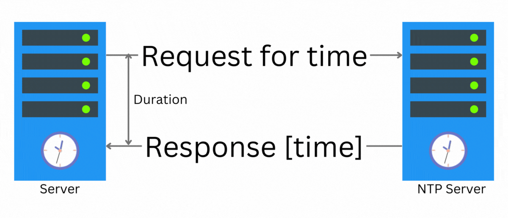

The number of activities/transactions that modern applications have to handle has increased significantly in past few decades. The usage
of applications became global as well. Also, the rise of the microservices requires engineers to have some knowledge of distributed systems.
There was a lot of expectation that I knew, I had to give up to understand the challenge of such systems.

## Fallacy: Total order can be established!!!

In a distributed system it is hard to have a total order across all the events in distributed system. WHAT!!! We have time in each machine, right?
We can use [NTP](https://en.wikipedia.org/wiki/Network_Time_Protocol) to sync time between clocks in different location, right?
Yes we can. But there would always be a difference even if that is 100ms.

When a server requests an NTP server for the time. It does not know when the time was generated. It knows the round trip time.
So it approximates the one way time by half of round trip time. But that is an assumption which is often not true. And there are hardware limitations,
causing different clocks to have inaccuracy even after time is synced properly.

But some large service providers like google, came up with [spanner](https://cloud.google.com/spanner). Which uses,

- Private fiber-optics connection around the world.
- Predictable network congestion.
- Atomic clock to keep the time synchronized across the world.

> But in general we need to keep in mind that time is not synced across different machines.

## Fallacy: Node failures can be consistently detected

There are different kinds of failure modes for a node.

1. Crash Stop
2. Omissions
3. Crash Recovery
4. Byzantine / Arbitrary

If you want to read more about failure models, read [here](https://distash.blogspot.com/2010/03/failure-detector-in-timing-model.html). More on [failure
detection](https://distash.blogspot.com/2010/03/failure-detectors-and-it-properties.html).

In short, it is not easy to detect that some node crashed connected in a network. The failure detections are mostly timeout based.
What if the node comes back after the timeout, because of a network delay. The problem occurs if that node was a master. Now if there was a
rudimentary algorithm then you would accept write and have to run reconciliation after the node came back. Because now some other node is the master, and it also took some writes.

Now a lot of issue goes away if the communication protocol is reliable.

## Challenge: Consensus across all nodes is expensive

In a distributed system at scale, it is expensive to agree on the same decision for all the nodes. For some cases we would have to do that,
like leader election. Everyone needs to acknowledge same node as a leader. [Paxos](https://www.scylladb.com/glossary/paxos-consensus-algorithm/) and
[Raft](<https://en.wikipedia.org/wiki/Raft_(algorithm)>) are commonly used for consensus. These algorithms are not run to agree on all the transactions, as this is expensive. So most of the distributed system avoid this problem by splitting the data into multiple shards and having one owner of each shard. For one data to be written we should be able to identify which shard it belongs to and then directly write through the shard master. The
replicas then replicate from the master. Now for consistency you need to read from master as well. The replicas are used to support master failure.

> In MySql we have auto increment integer as primary key. Have you ever wondered why MongoDb does not have system supported auto increment primary key?
> It is for the same reason, to have a central increment number it becomes the blocker and the writes does not scale as intended.

## Challenge: Consumer hardware

The reason we can run such large operations widely and cheaply is because Infrastructure as a Service (IaaS) and Platform as a Service (PaaS).
And the reason they can offer cheap is that the hardware used there is cheap. There are limitations on the resources. The storage unit is connected by
network. The storage used has limited IOPs.

Any distributed algorithm needs to be able to run on this faulty hardware.

## References

- [Node failure](https://distash.blogspot.com/2010/02/node-failure.html)
- [Failure detector in timing model](https://distash.blogspot.com/2010/03/failure-detector-in-timing-model.html)
- [Failure Detectors and it's properties](https://distash.blogspot.com/2010/03/failure-detectors-and-it-properties.html)
