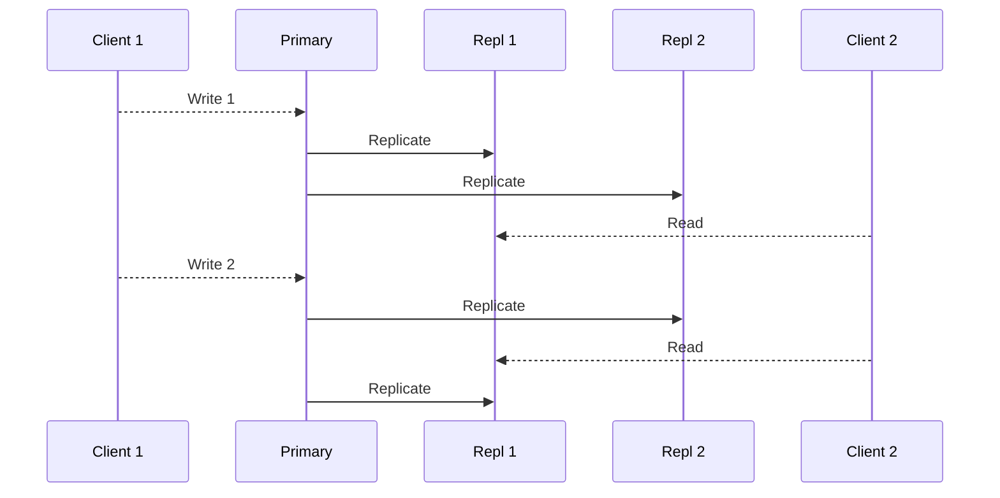
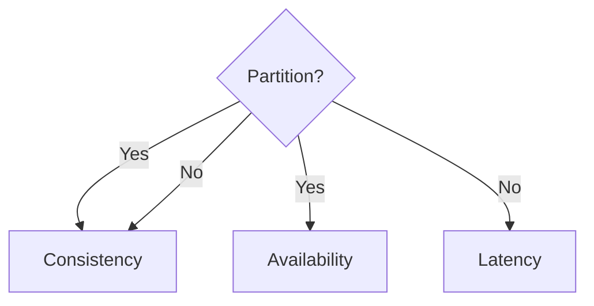

# CAP theorem

---

## Why distribute?

- Scale storage/performance ➞ Sharding <!-- .element: class="fragment" -->
- Failure(Fault) ➞ Tolerance/Availability <!-- .element: class="fragment" -->
- Tolerance ➞ Replication <!-- .element: class="fragment" -->
- Replication ➞ Inconsistency <!-- .element: class="fragment" -->
- Consistency ➞ Low performance <!-- .element: class="fragment" -->

---

## CAP theorem

- [Consistency](https://en.wikipedia.org/wiki/Consistency_model):
  Every read receives the most recent write or an error. Every client sees the same data at same time.

<!-- .element: class="fragment" -->

- [Availability](https://en.wikipedia.org/wiki/Availability):
  Every request receives a (non-error) response

<!-- .element: class="fragment" -->

- [Partition tolerance](https://en.wikipedia.org/wiki/Network_partitioning):
  The system continues to operate despite an arbitrary number of messages being dropped (or delayed) by the network between nodes

<!-- .element: class="fragment" -->

---

---

## Choose Two

- **CP database** → A CP database delivers consistency and partition tolerance at the expense of availability, i.e. **MongoDb**

<!-- .element: class="fragment text-3xl" -->

- **AP database** → An AP database delivers availability and partition tolerance at the expense of consistency, i.e. **Cassandra, Apache CouchDB, ScyllaDB**

<!-- .element: class="fragment text-3xl" -->

- **CA database** → A CA database delivers consistency and availability across all nodes. It can’t do this if there is a partition between any two nodes in the system, however, and therefore can’t deliver fault tolerance i.e. **MySQL**

<!-- .element: class="fragment text-3xl" -->

---

## Consistency?

---

## PACELC

