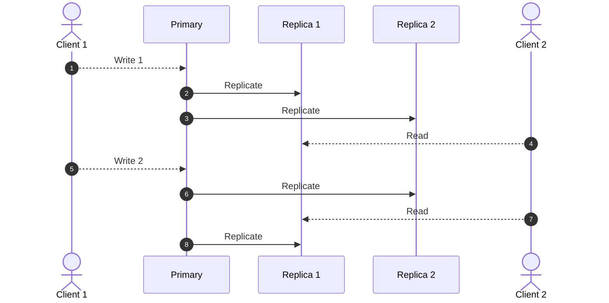
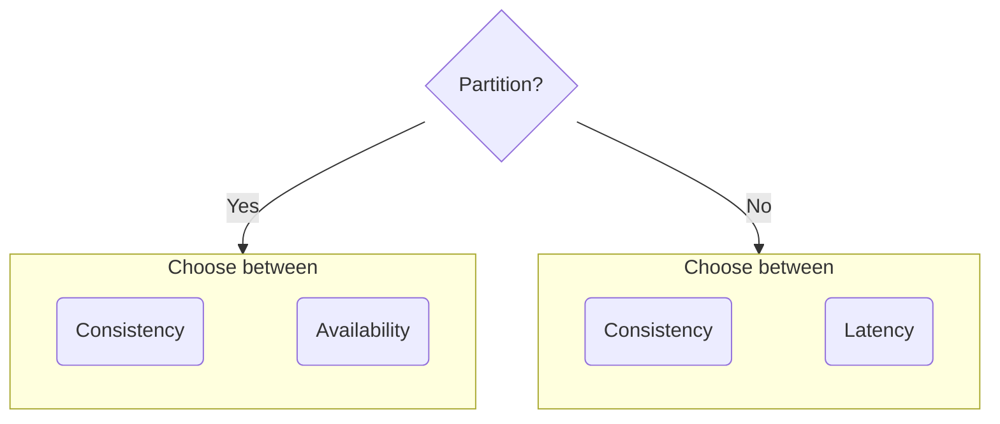

# CAP theorem

---

### Why distribute?

- Scale storage/performance ➞ Sharding
- Failure(Fault) ➞ Tolerance/Availability
- Tolerance ➞ Replication
- Replication ➞ Inconsistency
- Consistency ➞ Low performance

<!-- .element: class="fragmented-list" -->

---

### CAP theorem

- [Consistency](https://en.wikipedia.org/wiki/Consistency_model):
  Every read receives the most recent write or an error. Every client sees the same data at same time.
- [Availability](https://en.wikipedia.org/wiki/Availability):
  Every request receives a (non-error) response
- [Partition tolerance](https://en.wikipedia.org/wiki/Network_partitioning):
  The system continues to operate despite an arbitrary number of messages being dropped (or delayed) by the network between nodes

<!-- .element: class="fragmented-list" -->

---

---

### Choose Two

- **CP database** → A CP database delivers consistency and partition tolerance at the expense of availability, i.e. **MongoDb**
- **AP database** → An AP database delivers availability and partition tolerance at the expense of consistency, i.e. **Cassandra, Apache CouchDB, ScyllaDB**
- **CA database** → A CA database delivers consistency and availability across all nodes. It can’t do this if there is a partition between any two nodes in the system, however, and therefore can’t deliver fault tolerance i.e. **MySQL**

<!-- .element: class="fragmented-list text-3xl" -->

---

### Consistency?

---

### PACELC

---

### MySQL Replication

---

### Mongo sharding

---

### Quorum read / write

---

Node / Network failure tolerance for Quorum read / write

<!-- .element: class="fragment text-6xl" -->

**N/2 - 1**

<!-- .element: class="fragment text-7xl" -->

---

### Mongo read concern

- “local”
  - The query returns data from the instance with no guarantee that the data has been written to a majority of the replica set members (i.e. may be rolled back).
- "majority"
  - The query returns the data that has been acknowledged by a majority of the replica set members. The documents returned by the read operation are durable, even in the event of failure.

<!-- .element: class="text-2xl" -->

---

### Mongo read concern

- “majority”
  - Requests acknowledgment that write operations have been durably committed to the calculated majority of the data-bearing voting members
- \<number\>
  - w: 1
    - Requests acknowledgment that the write operation has propagated to the standalone mongod or the primary in a replica set. Data can be rolled back if the primary steps down before the write operations have replicated to any of the secondaries.

<!-- .element: class="text-2xl" -->

---

## Lines are getting blurred

---

## Google Spanner

- Relational database
- Scales horizontally, unlimited scale
- Strong-ACID with TrueTime ordering
- 99.999% availability
- Zero downtime and no maintenance window

 <!-- .element: class="fragmented-list" -->

---

### Google Spanner: True time

---

### Google Spanner: Reliable failure detection

---

### Google Spanner: Consistency

---

### Reference

- [CAP theorem: consistency vs availability](https://ashrafuzzaman.github.io/posts/cap-theorem-consistency-vs-availability/)
- [Cap theorem: IBM](https://www.ibm.com/topics/cap-theorem)
- [You Can’t Sacrifice Partition Tolerance](https://codahale.com/you-cant-sacrifice-partition-tolerance/)
- [Google's subsea fiber optics, explained](https://cloud.google.com/blog/topics/developers-practitioners/googles-subsea-fiber-optics-explained)
- [Google spanner consistency](https://www.youtube.com/watch?v=sOtlaH-QlxM&t=3s&ab_channel=GoogleCloudTech)
