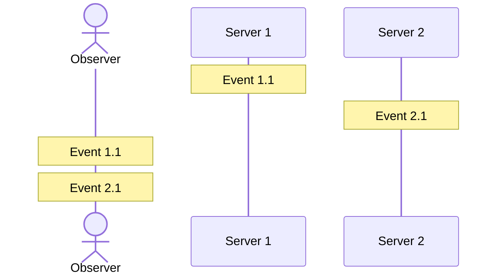
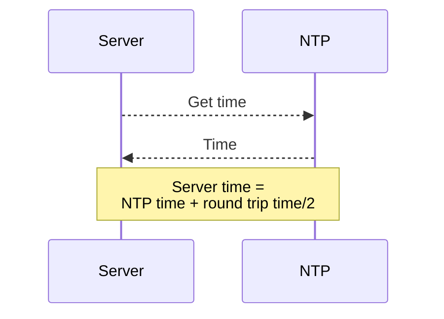
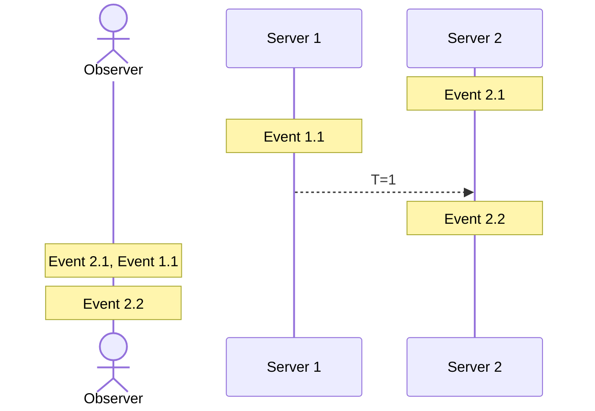
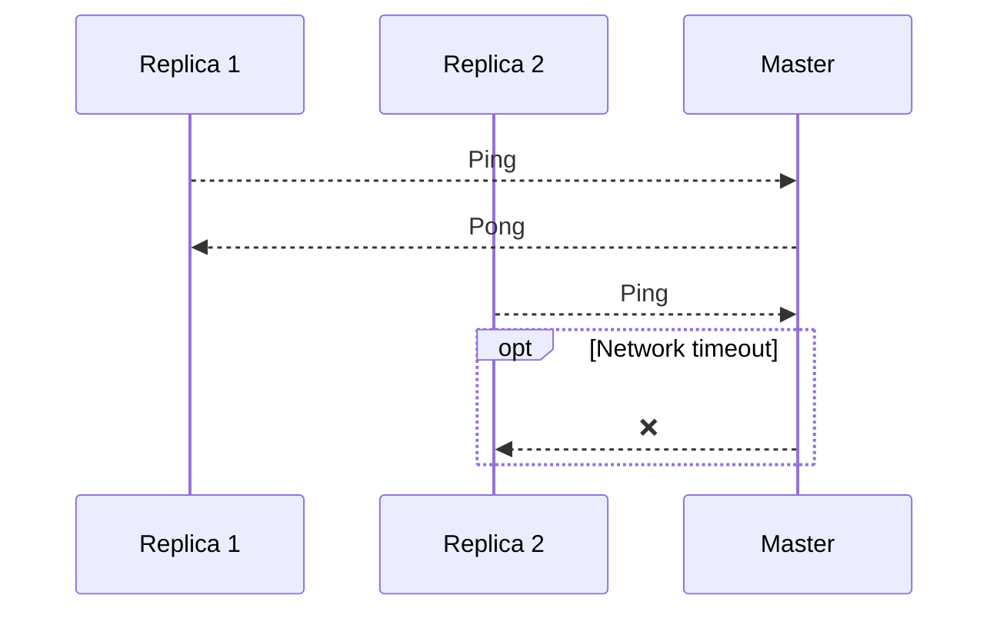
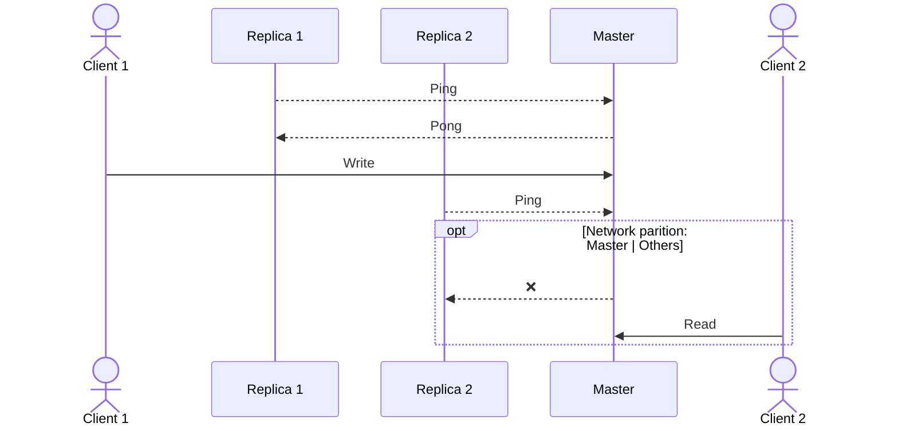

# Distributed system

## The basics <!-- .element: class="fragment" -->

---

### Topic

- Total order
<!-- .element: class="fragment" -->
- Failure detection
<!-- .element: class="fragment" -->

---

### Order between events

---

### NTP Sync

---

### Logical time

---

### Key takeaways

- Network is unreliable
- NTP sync cannot be trusted

---

### M87 blackhole

---

---

## Failure detection

---

## Detecting node failure

---

# Node failure types

- Crash Stop
- Omissions
- Crash Recovery
- Byzantine / Arbitrary

---

### Crash Stop

- Node stop doing anything(sending/receiving/processing)
- Once fail never recover

---

### Crash Stop: Challenges

- Can lead to leader election
- Initiate rebalancing/replication
- Identification of latest checkpoint

---

### Omissions

- **Sending omission:** not sending data where node is supposed to send according to algorithm
- **Receiving omission:** not receiving data when other node has sent message

---

Omission is actually a **temporary** state which eventually turns to a **crash** or a **crash recovery** state.

---

### Crash Recovery

- A node might crash
- It recovers after crashing and initiates a recovery process

---

### Crash Recovery: Challenges

- Recovery process
- Compensation

---

### Byzantine / Arbitrary

A node may behave arbitrary(sending/receiving messages that are not specified by algorithm).

This can be a malicious attack to the system.

---

### Network partition

---

## References

- [Node Failure](https://distash.blogspot.com/search/label/Crash)
- [Total order issue](https://ashrafuzzaman.github.io/posts/understanding-the-challenges-of-distributed-system/)
