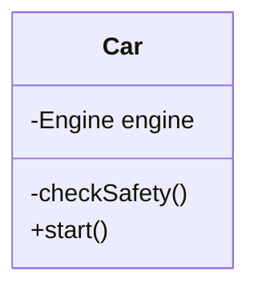
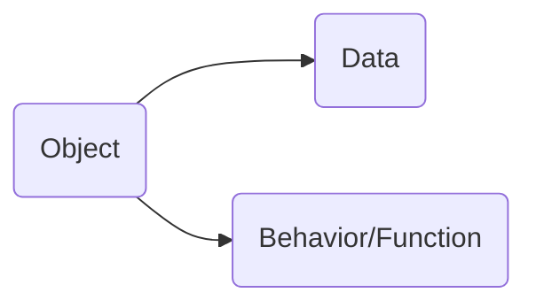
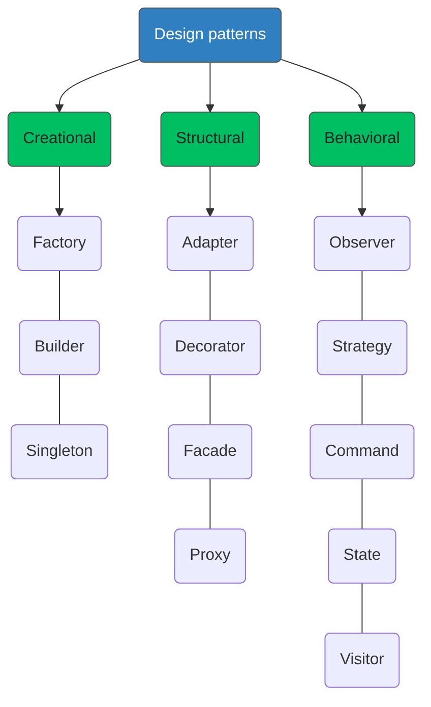
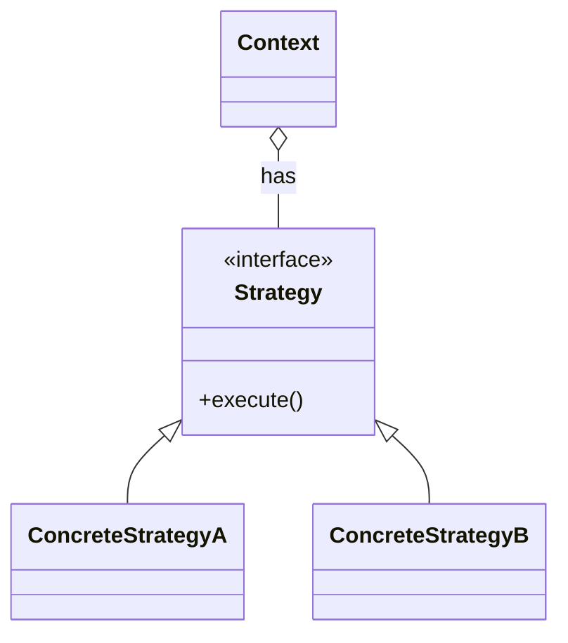
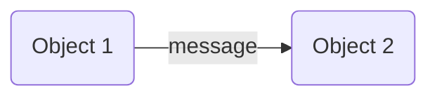
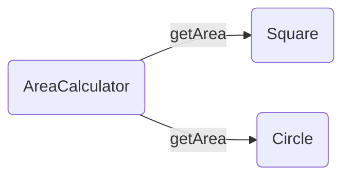

## Object Oriented programming

## vs <!-- .element: class="fragment" -->

## Functional programming <!-- .element: class="fragment" -->

---

### Object Oriented programming (OOP)

- Encapsulation
- Inheritance
- Polymorphism

<!-- .element: class="fragmented-list" -->

---

### Why: Encapsulation?

- Restrict access
  - Data hiding
  - Private methods
- Enable to change private data/methods

<!-- .element: class="fragmented-list" -->

---

### Why: Encapsulation?



```js [1|2|3]
car.engine.start(); ❌
car.checkSafety();  ❌
car.start();
```

---

### Can we do Encapsulation in FP?

## YES WE CAN <!-- .element: class="fragment" -->

---

### Data encapsulation in FP

```js [1|2-4|6|7|1-7]
function buildCar(engine: Engine) {
  return {
    start: () => {
      engine.start();
    },
  };
}
const car = buildCar(new Engine());
car.start();
```

---

## This is called Closure

---

## Now what about inheritance and polymorphism??

---

## What is an Object?



---

## Design pattern in OOP

---



---

### Strategy pattern



---

### In FP it is just a function type

```typescript[1|3-5|7-9]
type StrategyType = () => void;

const ConcreteStrategyA: StrategyType = () => {
  return "ConcreteStrategyA";
};

const ConcreteStrategyB: StrategyType = () => {
  return "ConcreteStrategyB";
};
```

---

### Remember the gravitational force equation?

`$$  F = \frac{G(m1*m2)}{R^2} $$`

<!-- .element: class="fragment" -->

---

```ts
class GForce {
  G = 6.67 * 10 ** -11;
  constructor(private m1: number, private r: number) {}

  calculateForce(m2: number) {
    return (this.G * (this.m1 * m2)) / this.r ** 2;
  }
}
```

---

```ts
class EarthGForce extends GForce {
  constructor() {
    const EARTHS_WEIGHT = 6 * 10 ** 24;
    const EARTHS_RADIUS = 6378;

    super(EARTHS_WEIGHT, EARTHS_RADIUS);
  }
}

const earthGForce = new EarthGForce();
earthGForce.calculateForce(72);
```

---

### How would it look in FP?

---

```ts [1-16|3]
function calculateGForce(m1, m2, r) {
  const G = 6.67 * 10 ** -11;
  return (G * (m1 * m2)) / r ** 2;
}

function calculateEarthGForceFn() {
  const EARTHS_WEIGHT = 6 * 10 ** 24;
  const EARTHS_RADIUS = 6378;

  return m2 => {
    return calculateGForce(EARTHS_WEIGHT, m2, EARTHS_RADIUS);
  };
}

const calculateEarthGForce = calculateEarthGForceFn();
calculateEarthGForce(72);
```

---

### I have not been fair to OO.

---

### The example are in favor of FP.

---

## OO and FP are just different tools

---

## Can FP do all that OO can do?

### That would not be the right way to look at it.

<!-- .element: class="fragment" -->

---

### Imperative programming

### VS

### declarative programming

---

| Characteristic            | Imperative approach                                                  | Functional approach                                                |
| ------------------------- | -------------------------------------------------------------------- | ------------------------------------------------------------------ |
| Programmer focus          | How to perform tasks (algorithms) and how to track changes in state. | What information is desired and what transformations are required. |
| State changes             | Important.                                                           | Non-existent.                                                      |
| Order of execution        | Important.                                                           | Low importance.                                                    |
| Primary flow control      | Loops, conditionals, and function (method) calls.                    | Function calls, including recursion.                               |
| Primary manipulation unit | Instances of structures or classes.                                  | Functions as first-class objects and data collections.             |

<!-- .element: class="text-2xl" -->

---

## Imperative approach

### Defines how

<!-- .element: class="fragment" -->

---

## Functional approach

### Defines what

<!-- .element: class="fragment" -->

---

A programming paradigm/framework <span class="fragment highlight-blue">**limits**</span>
ways to do <span class="fragment highlight-red">**mistake**</span>.

---

## Alan Kay

<center>


</center>

### The inventor of Smalltalk.

<!-- .element: class="fragment" -->

---

### More important concept of OO is ...

<div class="fragment">

## Message passing to an object.



</div>

---



---

## The basic idea is

- The object can send message to other objects
- Object receiving the message can figure out how to handle the message

<!-- .element: class="fragmented-list" -->

---

### Resources

- [The purest coding style, where bugs are near impossible](https://www.youtube.com/watch?v=HlgG395PQWw&t=326s)
- [Alan Kays Definition Of Object Oriented](https://wiki.c2.com/?AlanKaysDefinitionOfObjectOriented)
