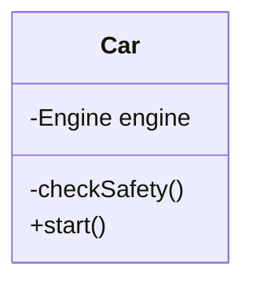

## Object Oriented programming

## vs <!-- .element: class="fragment" -->

## Functional programming <!-- .element: class="fragment" -->

---

### Object Oriented programming (OOP)

- Data encapsulation <!-- .element: class="fragment" -->
- Inheritance <!-- .element: class="fragment" -->
- Polymorphism <!-- .element: class="fragment" -->

---

### Why: data encapsulation?



```js [1|2]
car.engine.start(); ❌
car.checkSafety();  ❌
car.start();
```

---

### Why: data encapsulation?

---

### Resources

- [The purest coding style, where bugs are near impossible](https://www.youtube.com/watch?v=HlgG395PQWw&t=326s)
