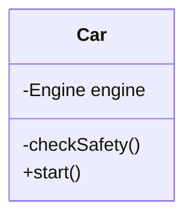
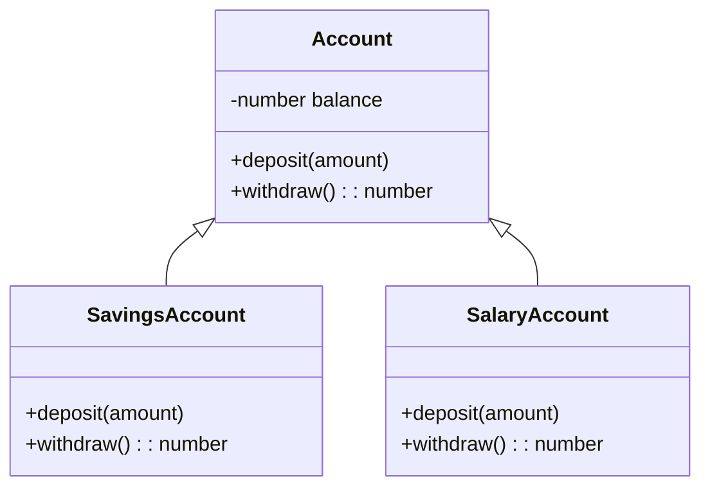
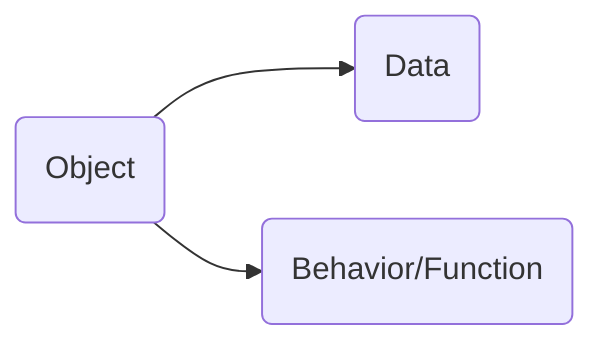
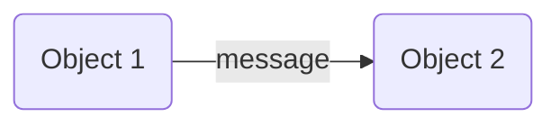
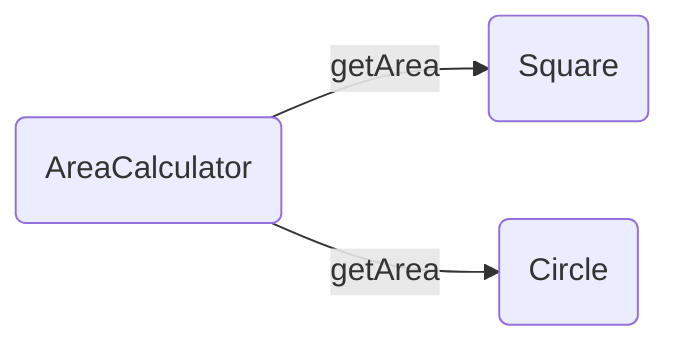

## Object Oriented programming

## vs <!-- .element: class="fragment" -->

## Functional programming <!-- .element: class="fragment" -->

---

> **War** is what happens when language fails. - Margaret Atwood

<center>


</center>

---

### Object Oriented programming (OOP)

- Encapsulation
- Inheritance
- Abstraction
- Polymorphism

<!-- .element: class="fragmented-list" -->

---

### Why: Encapsulation?

- Restrict access
  - Data hiding
  - Private methods
- Enable to change private data/methods

<!-- .element: class="fragmented-list" -->

---

### Why: Encapsulation?



```js [1|2|3]
car.engine.start(); ❌
car.checkSafety();  ❌
car.start();
```

---

### Can we do Encapsulation in FP?

## YES WE CAN <!-- .element: class="fragment" -->

---

### Data encapsulation in FP

```js [1-7|8-9|1-9]
function buildCar(engine: Engine) {
  return {
    start: () => {
      engine.start();
    },
  };
}
const car = buildCar(new Engine());
car.start();
```

---

## This is called Closure

---

## Now what about inheritance and polymorphism??

---

<!-- .element: id="account-class-diagram" -->

### Inheritance and Polymorphism



---

```ts [1-5|5]
account1 = new SavingsAccount(1000);
account2 = new SalaryAccount(1000);

// Unaware of the type of the account
account1.deposit(account2.withdraw(100));
```

---

## What is an Object?



---

## State management

| OOP                            | FP                                     |
| ------------------------------ | -------------------------------------- |
| State is coupled with behavior | State is managed by the message sender |

---

```ts
class Account {
  constructor(private balance: number) {}
  getBalance() {
    return this.balance;
  }
  deposit(amount: number) {
    this.balance += amount;
  }
  withdraw(amount: number) {
    this.balance -= amount;
    return amount;
  }
}

class Bank {
  constructor(private accounts: Account[]) {}
  transfer(transferFrom: Account, transferTo: Account, amount: number) {
    transferTo.deposit(transferFrom.withdraw(amount));
  }
}
```

---

```ts
let account1 = new Account(1000);
let account2 = new Account(1000);
const bank = new Bank([account1, account2]);
bank.transfer(account1, account2, 100);
```

---

## Let's see the code in FP

---

```ts
let bank = [
  { accountId: "account1", balance: 1000 },
  { accountId: "account2", balance: 1000 },
  { accountId: "account3", balance: 1000 },
];

function transferBalance(transferFromAccount, transferToAccount, amount) {
  const transferFromBalance = transferFromAccount.balance - amount;
  const transferToBalance = transferToAccount.balance + amount;
  return {
    transferFrom: {
      accountId: transferFromAccount.accountId,
      newBalance: transferFromBalance,
    },
    transferTo: {
      accountId: transferToAccount.accountId,
      newBalance: transferToBalance,
    },
  };
}
```

---

## How about testing?

---

## Test steps (AAA)

- Arrange
- Action
- Assert

<!-- .element: class="fragmented-list" -->

---

### Test OOP

```ts [1-10|2-4|6|8-9|1-10]
it("should transfer the specified amount", () => {
  const transferFrom = new Account(100);
  const transferTo = new Account(0);
  const bank = new Bank([transferFrom, transferTo]);

  bank.transfer(transferFrom, transferTo, 50);

  expect(transferFrom.getBalance()).toBe(50);
  expect(transferTo.getBalance()).toBe(50);
});
```

---

### Test FP

<!-- .element: id="current" -->

```ts [1-11|2-3|5|7-10|1-11]
it("should correctly transfer the specified amount", () => {
  const transferFromAccount = { accountId: 1, balance: 100 };
  const transferToAccount = { accountId: 2, balance: 50 };

  const result = transferBalance(transferFromAccount, transferToAccount, 30);

  expect(result.transferFrom.accountId).toBe({
    transferFrom: { accountId: 1, newBalance: 70 },
    transferTo: { accountId: 2, newBalance: 80 },
  });
});
```

---

## In FP we did not need the bank object to be arranged

---

## Testing in FP

- Simpler setup in real life
- Simple test without mocking side-effects

---

## Can FP do all that OO can do?

### That would not be the right way to look at it.

<!-- .element: class="fragment" -->

### OO and FP are just different tools

<!-- .element: class="fragment" -->

---

## Alan Kay

<center>


</center>

### The inventor of Smalltalk.

<!-- .element: class="fragment" -->

---

### More important concept of OO is ...

<div class="fragment">



#### Message passing to an object.

</div>

---

### The main idea was polymorphism



---

## The basic idea is

- The object can send message to other objects
- Object receiving the message can figure out how to handle the message
- OOP helps explain the domain better that matches with real life

<!-- .element: class="fragmented-list" -->

---

## Power of pure function is in distribution

---

## Attributes of pure function

- For the same input the output is always the same
- Function execution does not create side effect
- Lazy evaluation
- Immutable parameters

---


---

```python
rdd = spark.sparkContext.textFile("/tmp/test.txt")
rdd2 = rdd.flatMap(lambda x: x.split(" "))
rdd3 = rdd2.map(lambda x: (x,1))
rdd4 = rdd3.reduceByKey(lambda a,b: a+b)
rdd5 = rdd4.map(lambda x: (x[1],x[0])).sortByKey()
print(rdd5.collect())
```

---

### OOP is good when,

- Defining relations with concepts in real life, where information and behavior needs to be encapsulated.

---

### FP is good when,

- Transformation of data is more important than state management

---

### Resources

- [The purest coding style, where bugs are near impossible](https://www.youtube.com/watch?v=HlgG395PQWw&t=326s)
- [Alan Kays Definition Of Object Oriented](https://wiki.c2.com/?AlanKaysDefinitionOfObjectOriented)
